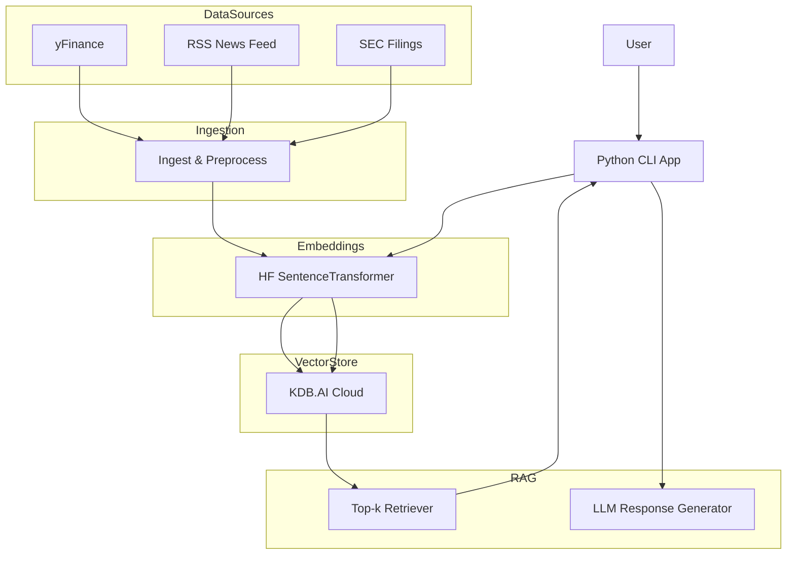

# 📈 RAG-Based Stock Assistant (Docker + KDB.AI Cloud)

This project is a **Retrieval-Augmented Generation (RAG) stock assistant**, built using:
- **Python CLI** interface (Dockerized)
- **KDB.AI Cloud** as the vector store (free SaaS tier)
- **HuggingFace embeddings**
- **Real-time stock data sources**: yFinance, RSS, and SEC EDGAR filings

---

## ⚙️ How It Works

1. Ingest stock prices, news, and SEC filings.
2. Embed documents using a SentenceTransformer model.
3. Store embeddings in **KDB.AI Cloud**.
4. Accept a user query via CLI.
5. Embed the query and retrieve top-k similar documents.
6. Generate a natural-language answer using an LLM (local or API).

---

## 🧭 Architecture (Simple)


## 🧱 Extended Architecture (Docker + APIs + CLI)
```mermaid
flowchart TD
  subgraph User
    U[User]
    CLI[CLI App (Docker)]
    U --> CLI
  end

  subgraph APIs
    YF[yFinance API]
    RSS[RSS Feed]
    SEC[EDGAR API]
  end

  subgraph Ingestion
    INGEST[ingest.py]
    YF --> INGEST
    RSS --> INGEST
    SEC --> INGEST
  end

  subgraph Embeddings
    HF[embed.py (HF Model)]
    INGEST --> HF
    CLI --> HF
  end

  subgraph VectorStore
    KDB[KDB.AI Cloud]
    HF --> KDB
    KDB --> CLI
  end

  subgraph RAG
    RETRIEVE[query.py]
    LLM[Local/Open-source LLM]
    CLI --> RETRIEVE
    RETRIEVE --> LLM
  end
```